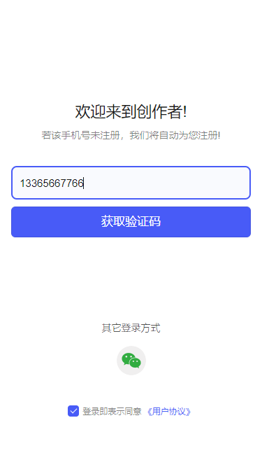
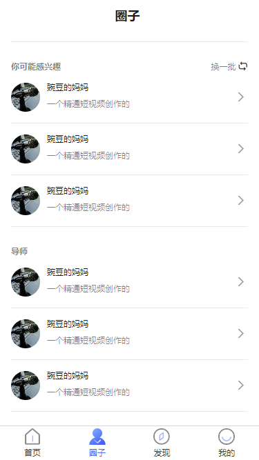
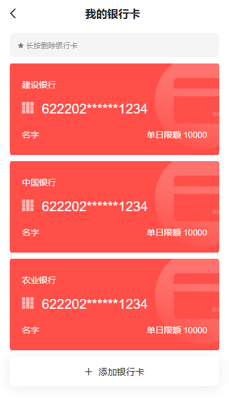
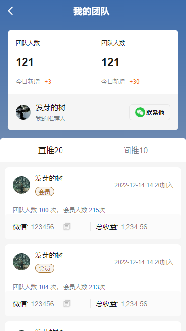
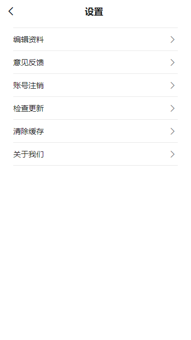

# dy-app

uni-app vue3 写的大型单页程序，30 多个页面，可打包成 app，h5。

## 预览



## 安装依赖

```sh
yarn
```

## 开启 app 开发环境

```sh
yarn dev:app
```

## 代码校验

```sh
yarn lint
```

## css 校验

```sh
yarn stylelint
```

## 代码格式化

```sh
yarn prettier
```

## 升级 dcloudio 包

```sh
yarn  uvm
```

## 代码提交,校验样式，校验代码

```sh
./update.sh
```

## app 打包

```sh
yarn build:app
```
